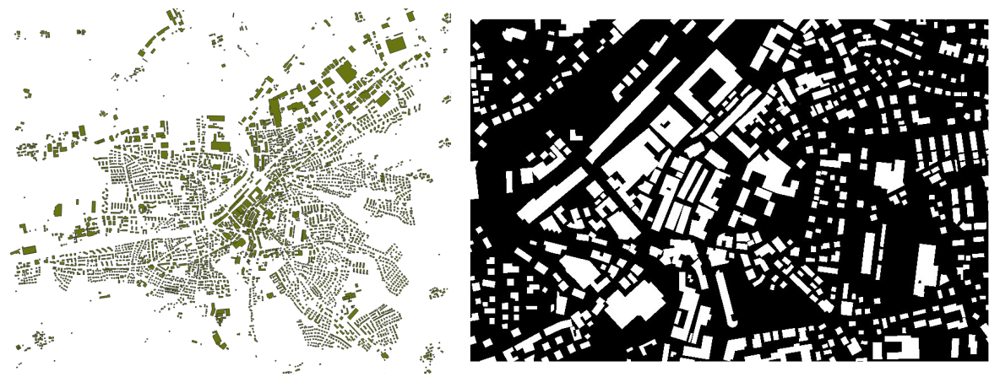

# Overview
This tool allows one to rasterize a shapefile, automatically turning it into a binary GeoTiff file. This is usefull when creating ground truth dataset for image segmentation and/or object detection. The thought use case was transforming polygons of the houses in Switzerland into raster with a croping argument.

## auto-rasterize
In order to use this code, the main arguments are input shapefile path, output GeoTiff (.tif) file path and crop arguments. Of those, you'll have minimum X (longitude), minimum Y (latitude), maximum X and maximum Y. At last, the pixel size shall be defined as well. 

The following exemplifies the code usage in a linux terminal in the CH1903+ Swiss Coordinate System.

```
$ ./auto-rasterize -i /path/polygon.shp --xmin 2709346 --ymax 1268695 --xmax 2710488 --ymin 1267939 -p 1.25

$ python3 auto-rasterize -i /path/polygon.shp --xmin 2709346 --ymax 1268695 --xmax 2710488 --ymin 1267939 -p 1.25
```

The figure below demonstrates a polygon of houses in Frauenfeld (TG - Switzerland) - image on the left -  being rasterized and croped to a specific extent - image on the right.



If you don't have the coordinates from the crop, you may also extract them from another raster, and use it as reference. Follow the example below if this is your prefered choice.

```
$ ./auto-rasterize -i /path/polygon.shp -/path/crop.tif -p 1.25

$ python3 auto-rasterize -i /path/polygon.shp -/path/crop.tif -p 1.25
```

# Copyright and License

**auto-rasterize** - Huriel Reichel, Nils Hamel <br />
Copyright (c) 2020 Republic and Canton of Geneva

This program is licensed under the terms of the GNU GPLv3. Documentation and illustrations are licensed under the terms of the CC BY-NC-SA.

# Dependencies

Python 3.8.5 or superior.

Packages may be installed either with pip or conda

* GDAL 3.1.3

* ogr 0.18.1


